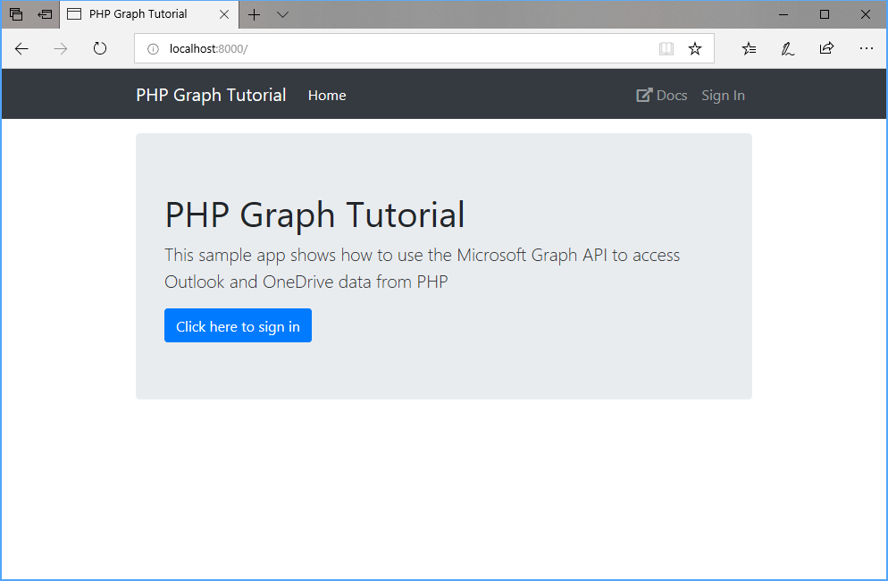

<!-- markdownlint-disable MD002 MD041 -->

Öffnen Sie die Befehlszeilenschnittstelle (CLI), navigieren Sie zu einem Verzeichnis, in dem Sie über Berechtigungen zum Erstellen von Dateien verfügen, und führen Sie den folgenden Befehl aus, um eine neue php-app zu erstellen.

```Shell
laravel new graph-tutorial
```

Laravel erstellt ein neues Verzeichnis mit `graph-tutorial` dem Namen und Gerüste einer php-app. Navigieren Sie zu diesem neuen Verzeichnis, und geben Sie den folgenden Befehl ein, um einen lokalen Webserver zu starten.

```Shell
php artisan serve
```

Öffnen Sie Ihren Browser und navigieren Sie zu `http://localhost:8000`. Wenn alles funktioniert, wird eine standardmäßige Laravel-Seite angezeigt. Wenn diese Seite nicht angezeigt wird, überprüfen Sie die [Laravel-Dokumente](https://laravel.com/docs/5.6).

Installieren Sie vor dem Verschieben einige zusätzliche Bibliotheken, die Sie später verwenden werden:

- [oauth2-Client](https://github.com/thephpleague/oauth2-client) für die Verarbeitung von Anmelde-und OAuth-Token-Flows.
- [Microsoft-Graph](https://github.com/microsoftgraph/msgraph-sdk-php) für das tätigen von Anrufen an Microsoft Graph.

Führen Sie den folgenden Befehl in der CLI aus.

```Shell
composer require league/oauth2-client:dev-master microsoft/microsoft-graph
```

## <a name="design-the-app"></a>Entwerfen der APP

Erstellen Sie zunächst das globale Layout für die app. Erstellen Sie eine neue Datei im `./resources/views` Verzeichnis mit `layout.blade.php` dem Namen, und fügen Sie den folgenden Code hinzu.

```php
<!DOCTYPE html>
<html>
  <head>
    <title>PHP Graph Tutorial</title>

    <link rel="stylesheet" href="https://stackpath.bootstrapcdn.com/bootstrap/4.1.1/css/bootstrap.min.css"
        integrity="sha384-WskhaSGFgHYWDcbwN70/dfYBj47jz9qbsMId/iRN3ewGhXQFZCSftd1LZCfmhktB" crossorigin="anonymous">
    <link rel="stylesheet" href="https://use.fontawesome.com/releases/v5.1.0/css/all.css"
        integrity="sha384-lKuwvrZot6UHsBSfcMvOkWwlCMgc0TaWr+30HWe3a4ltaBwTZhyTEggF5tJv8tbt" crossorigin="anonymous">
    <link rel="stylesheet" href="{{ asset('/css/app.css') }}">
    <script src="https://code.jquery.com/jquery-3.3.1.min.js"></script>
    <script src="https://cdnjs.cloudflare.com/ajax/libs/popper.js/1.14.3/umd/popper.min.js"
        integrity="sha384-ZMP7rVo3mIykV+2+9J3UJ46jBk0WLaUAdn689aCwoqbBJiSnjAK/l8WvCWPIPm49" crossorigin="anonymous"></script>
    <script src="https://stackpath.bootstrapcdn.com/bootstrap/4.1.1/js/bootstrap.min.js"
        integrity="sha384-smHYKdLADwkXOn1EmN1qk/HfnUcbVRZyYmZ4qpPea6sjB/pTJ0euyQp0Mk8ck+5T" crossorigin="anonymous"></script>
  </head>

  <body>
    <nav class="navbar navbar-expand-md navbar-dark fixed-top bg-dark">
      <div class="container">
        <a href="/" class="navbar-brand">PHP Graph Tutorial</a>
        <button class="navbar-toggler" type="button" data-toggle="collapse" data-target="#navbarCollapse"
            aria-controls="navbarCollapse" aria-expanded="false" aria-label="Toggle navigation">
          <span class="navbar-toggler-icon"></span>
        </button>
        <div class="collapse navbar-collapse" id="navbarCollapse">
          <ul class="navbar-nav mr-auto">
            <li class="nav-item">
              <a href="/" class="nav-link {{$_SERVER['REQUEST_URI'] == '/' ? ' active' : ''}}">Home</a>
            </li>
            @if(isset($userName))
              <li class="nav-item" data-turbolinks="false">
                <a href="/calendar" class="nav-link{{$_SERVER['REQUEST_URI'] == '/calendar' ? ' active' : ''}}">Calendar</a>
              </li>
            @endif
          </ul>
          <ul class="navbar-nav justify-content-end">
            <li class="nav-item">
              <a class="nav-link" href="https://developer.microsoft.com/graph/docs/concepts/overview" target="_blank">
                <i class="fas fa-external-link-alt mr-1"></i>Docs
              </a>
            </li>
            @if(isset($userName))
              <li class="nav-item dropdown">
                <a class="nav-link dropdown-toggle" data-toggle="dropdown" href="#" role="button"
                  aria-haspopup="true" aria-expanded="false">
                  @if(isset($user_avatar))
                    
                  @else
                    <i class="far fa-user-circle fa-lg rounded-circle align-self-center mr-2" style="width: 32px;"></i>
                  @endif
                </a>
                <div class="dropdown-menu dropdown-menu-right">
                  <h5 class="dropdown-item-text mb-0">{{ $userName }}</h5>
                  <p class="dropdown-item-text text-muted mb-0">{{ $userEmail }}</p>
                  <div class="dropdown-divider"></div>
                  <a href="/signout" class="dropdown-item">Sign Out</a>
                </div>
              </li>
            @else
              <li class="nav-item">
                <a href="/signin" class="nav-link">Sign In</a>
              </li>
            @endif
          </ul>
        </div>
      </div>
    </nav>
    <main role="main" class="container">
      @if(session('error'))
        <div class="alert alert-danger" role="alert">
          <p class="mb-3">{{ session('error') }}</p>
          @if(session('errorDetail'))
            <pre class="alert-pre border bg-light p-2"><code>{{ session('errorDetail') }}</code></pre>
          @endif
        </div>
      @endif

      @yield('content')
    </main>
  </body>
</html>
```

Dieser Code fügt [Bootstrap](http://getbootstrap.com/) für einfaches Styling und [Font awesome](https://fontawesome.com/) für einige einfache Symbole hinzu. Außerdem wird ein globales Layout mit einer Navigationsleiste definiert.

Öffnen `./public/css/app.css` Sie nun und ersetzen Sie den gesamten Inhalt durch Folgendes.

```css
body {
  padding-top: 4.5rem;
}

.alert-pre {
  word-wrap: break-word;
  word-break: break-all;
  white-space: pre-wrap;
}
```

Aktualisieren Sie nun die Standardseite. Öffnen Sie `./resources/views/welcome.blade.php` die Datei, und ersetzen Sie den Inhalt durch Folgendes.

```php
@extends('layout')

@section('content')
<div class="jumbotron">
  <h1>PHP Graph Tutorial</h1>
  <p class="lead">This sample app shows how to use the Microsoft Graph API to access Outlook and OneDrive data from PHP</p>
  @if(isset($userName))
    <h4>Welcome {{ $userName }}!</h4>
    <p>Use the navigation bar at the top of the page to get started.</p>
  @else
    <a href="/signin" class="btn btn-primary btn-large">Click here to sign in</a>
  @endif
</div>
@endsection
```

Aktualisieren Sie die `Controller` Basisklasse `./app/Http/Controllers/Controller.php` , indem Sie der Klasse die folgende Funktion hinzufügen.

```php
public function loadViewData()
{
  $viewData = [];

  // Check for flash errors
  if (session('error')) {
    $viewData['error'] = session('error');
    $viewData['errorDetail'] = session('errorDetail');
  }

  // Check for logged on user
  if (session('userName'))
  {
    $viewData['userName'] = session('userName');
    $viewData['userEmail'] = session('userEmail');
  }

  return $viewData;
}
```

Fügen Sie als nächstes einen Controller für die Startseite hinzu. Erstellen Sie eine neue Datei im `./app/Http/Controllers` Verzeichnis mit `HomeController.php` dem Namen, und fügen Sie den folgenden Code hinzu.

```php
<?php

namespace App\Http\Controllers;

use App\Http\Controllers\Controller;
use Illuminate\Http\Request;

class HomeController extends Controller
{
  public function welcome()
  {
    $viewData = $this->loadViewData();

    return view('welcome', $viewData);
  }
}
```

Aktualisieren Sie schließlich die Route in `./routes/web.php` , um den neuen Controller zu verwenden. Ersetzen Sie den gesamten Inhalt dieser Datei durch Folgendes:

```php
<?php

Route::get('/', 'HomeController@welcome');
```

Speichern Sie alle Änderungen, und starten Sie den Server neu. Nun sollte die APP sehr unterschiedlich aussehen.


