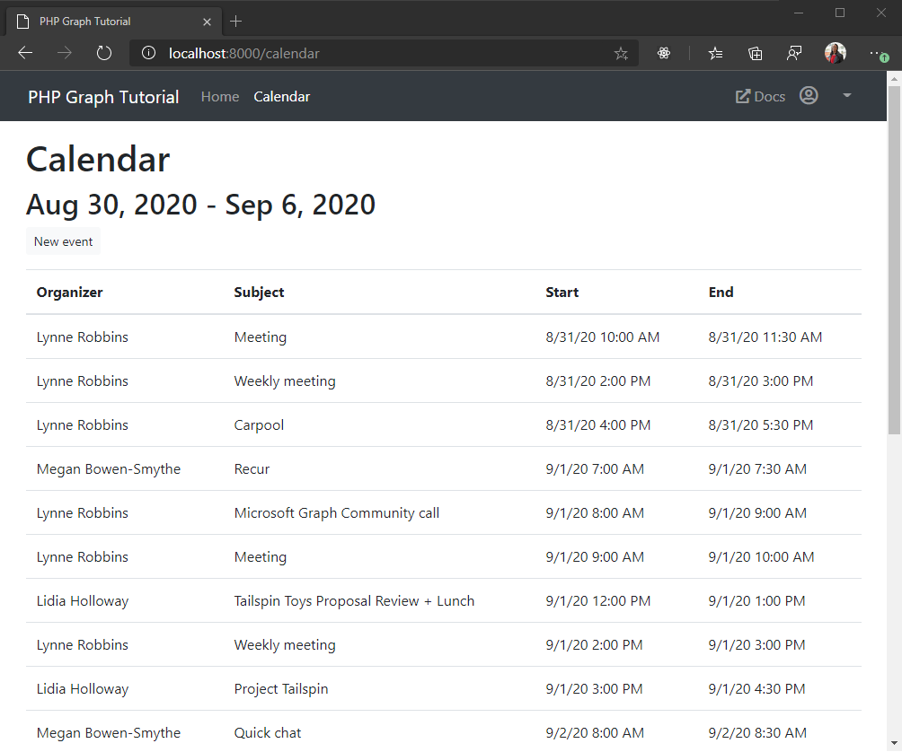

<!-- markdownlint-disable MD002 MD041 -->

In dieser Übung werden Sie das Microsoft Graph in die Anwendung integrieren. Für diese Anwendung verwenden Sie die [Microsoft-Graph-](https://github.com/microsoftgraph/msgraph-sdk-php) Bibliothek, um Anrufe an Microsoft Graph zu tätigen.

## <a name="get-calendar-events-from-outlook"></a>Abrufen von Kalenderereignissen aus Outlook

Beginnen wir mit dem Hinzufügen eines Controllers für die Kalenderansicht. Erstellen Sie eine neue Datei im `./app/Http/Controllers` Ordner mit `CalendarController.php`dem Namen, und fügen Sie den folgenden Code hinzu.

```php
<?php

namespace App\Http\Controllers;

use App\Http\Controllers\Controller;
use Illuminate\Http\Request;
use Microsoft\Graph\Graph;
use Microsoft\Graph\Model;
use App\TokenStore\TokenCache;

class CalendarController extends Controller
{
  public function calendar()
  {
    $viewData = $this->loadViewData();

    // Get the access token from the cache
    $tokenCache = new TokenCache();
    $accessToken = $tokenCache->getAccessToken();

    // Create a Graph client
    $graph = new Graph();
    $graph->setAccessToken($accessToken);

    $queryParams = array(
      '$select' => 'subject,organizer,start,end',
      '$orderby' => 'createdDateTime DESC'
    );

    // Append query parameters to the '/me/events' url
    $getEventsUrl = '/me/events?'.http_build_query($queryParams);

    $events = $graph->createRequest('GET', $getEventsUrl)
      ->setReturnType(Model\Event::class)
      ->execute();

    return response()->json($events);
  }
}
```

Überprüfen Sie, was dieser Code tut.

- Die URL, die aufgerufen wird `/v1.0/me/events`.
- Der `$select` Parameter schränkt die für die einzelnen Ereignisse zurückgegebenen Felder auf diejenigen ein, die von der Ansicht tatsächlich verwendet werden.
- Der `$orderby` Parameter sortiert die Ergebnisse nach dem Datum und der Uhrzeit, zu der Sie erstellt wurden, wobei das letzte Element zuerst angezeigt wird.

Aktualisieren der Routen in `./routes/web.php` So fügen Sie diesem neuen Controller eine Route hinzu

```php
Route::get('/calendar', 'CalendarController@calendar');
```

Nun können Sie dies testen. Melden Sie sich an, und klicken Sie in der Navigationsleiste auf den Link **Kalender** . Wenn alles funktioniert, sollte ein JSON-Abbild der Ereignisse im Kalender des Benutzers angezeigt werden.

## <a name="display-the-results"></a>Anzeigen der Ergebnisse

Jetzt können Sie eine Ansicht hinzufügen, um die Ergebnisse auf eine benutzerfreundlichere Weise anzuzeigen. Erstellen Sie eine neue Datei im `./resources/views` Verzeichnis mit `calendar.blade.php` dem Namen, und fügen Sie den folgenden Code hinzu.

```php
@extends('layout')

@section('content')
<h1>Calendar</h1>
<table class="table">
  <thead>
    <tr>
      <th scope="col">Organizer</th>
      <th scope="col">Subject</th>
      <th scope="col">Start</th>
      <th scope="col">End</th>
    </tr>
  </thead>
  <tbody>
    @isset($events)
      @foreach($events as $event)
        <tr>
          <td>{{ $event->getOrganizer()->getEmailAddress()->getName() }}</td>
          <td>{{ $event->getSubject() }}</td>
          <td>{{ \Carbon\Carbon::parse($event->getStart()->getDateTime())->format('n/j/y g:i A') }}</td>
          <td>{{ \Carbon\Carbon::parse($event->getEnd()->getDateTime())->format('n/j/y g:i A') }}</td>
        </tr>
      @endforeach
    @endif
  </tbody>
</table>
@endsection
```

Dadurch wird eine Auflistung von Ereignissen durchlaufen und für jeden eine Tabellenzeile hinzugefügt. Entfernen Sie `return response()->json($events);` die- `calendar` Aktion in `./app/Http/Controllers/CalendarController.php`, und ersetzen Sie Sie durch den folgenden Code.

```php
$viewData['events'] = $events;
return view('calendar', $viewData);
```

Aktualisieren Sie die Seite, und die APP sollte jetzt eine Tabelle mit Ereignissen rendern.


