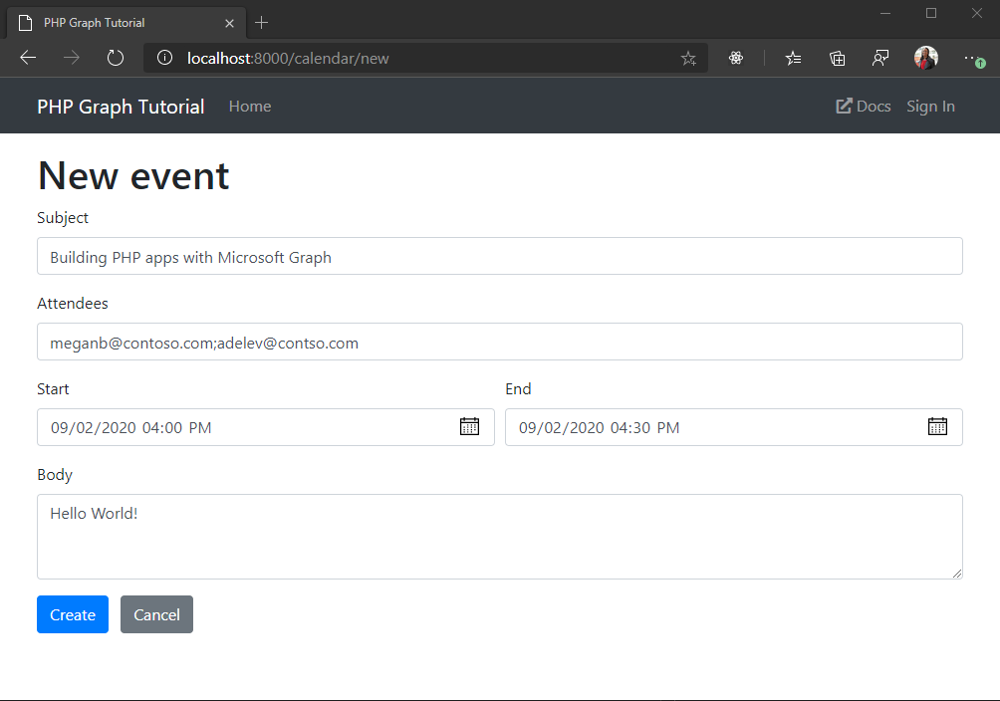

<!-- markdownlint-disable MD002 MD041 -->

In diesem Abschnitt können Sie die Möglichkeit zum Erstellen von Ereignissen im Kalender des Benutzers hinzufügen.

## <a name="create-new-event-form"></a>Erstellen eines neuen Ereignis Formulars

1. Erstellen Sie eine neue Datei im **./Resources/views** -Verzeichnis mit dem Namen `newevent.blade.php` , und fügen Sie den folgenden Code hinzu.

    :::code language="php" source="../demo/graph-tutorial/resources/views/newevent.blade.php" id="NewEventFormSnippet":::

## <a name="add-controller-actions"></a>Hinzufügen von controlleraktionen

1. Öffnen Sie **/App/http/Controllers/CalendarController.php** , und fügen Sie die folgende Funktion zum Rendern des Formulars hinzu.

    :::code language="php" source="../demo/graph-tutorial/app/Http/Controllers/CalendarController.php" id="getNewEventFormSnippet":::

1. Fügen Sie die folgende Funktion hinzu, um die Formulardaten zu empfangen, wenn der Benutzer übermittelt wird, und erstellen Sie ein neues Ereignis im Kalender des Benutzers.

    :::code language="php" source="../demo/graph-tutorial/app/Http/Controllers/CalendarController.php" id="createNewEventSnippet":::

    Überprüfen Sie die Funktionsweise dieses Codes.

    - Sie wandelt die Eingabe von Teilnehmern in ein Array von Graph- [Teilnehmer](https://docs.microsoft.com/graph/api/resources/attendee?view=graph-rest-1.0) Objekten um.
    - Es wird ein [Ereignis](https://docs.microsoft.com/graph/api/resources/event?view=graph-rest-1.0) aus der Formulareingabe erstellt.
    - Er sendet einen Beitrag an den `/me/events` Endpunkt und leitet dann zurück in die Kalenderansicht.

1. Aktualisieren Sie die Routen in **./routes/Web.php** , um Routen für diese neuen Funktionen auf dem Controller hinzuzufügen.

    ```php
    Route::get('/calendar/new', 'CalendarController@getNewEventForm');
    Route::post('/calendar/new', 'CalendarController@createNewEvent');
    ```

1. Speichern Sie alle Änderungen, und starten Sie den Server neu. Verwenden Sie die Schaltfläche **Neues Ereignis** , um zum neuen Ereignis Formular zu navigieren.

1. Geben Sie die Werte auf dem Formular ein. Verwenden Sie ein Startdatum aus der aktuellen Woche. Wählen Sie **Erstellen** aus.

    

1. Wenn die APP an die Kalenderansicht weitergeleitet wird, überprüfen Sie, ob das neue Ereignis in den Ergebnissen enthalten ist.
